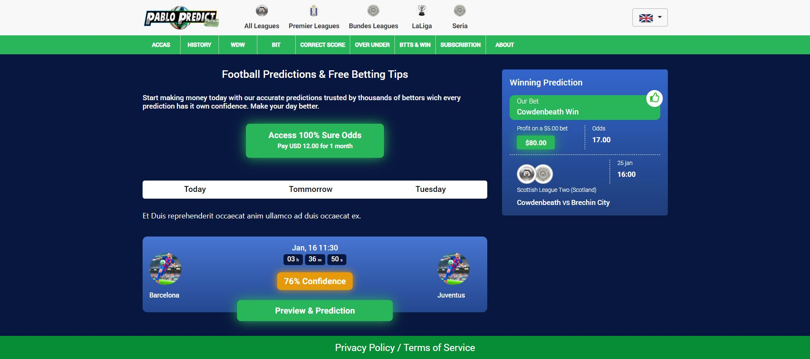

# Football Predictions Website

## Table of Contents
- [Description](#description)
- [Features](#features)
- [Getting Started](#getting-started)
- [Usage](#usage)
- [Technologies Used](#technologies-used)
- [Contributing](#contributing)
- [License](#license)

## Description

The Football Predictions Website is a web application designed to provide users with accurate and up-to-date football match predictions. It aims to help football enthusiasts make informed decisions when placing bets or predicting match outcomes. The website is built using HTML, CSS, and JavaScript.

## Features

- View upcoming football matches
- Access detailed match predictions
- Filter matches by leagues, teams, or dates
- User-friendly interface

## Getting Started

To run the Football Predictions Website locally on your machine, follow these steps:

1. Clone the repository to your local machine.
2. Navigate to the project directory.

## Usage

After setting up the project on your local machine, follow these steps:

1. Open the `home.html` file in your web browser.
2. Browse the list of upcoming football matches.
3. Click on a match to view its detailed prediction.

## Technologies Used

The following technologies were used to build this project:

- HTML
- CSS
- JavaScript

## Contributing

Contributions to the Football Predictions Website are always welcome. If you find any issues or want to add new features, feel free to open a pull request. For major changes, please open an issue first to discuss the proposed changes.

## License

This project is licensed under the [MIT License](LICENSE).
